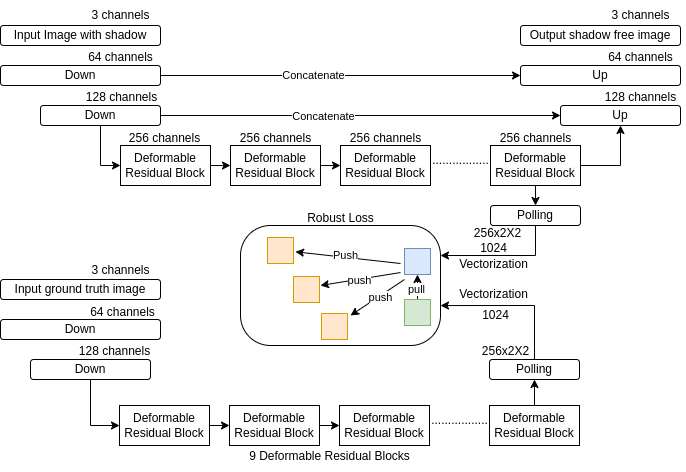
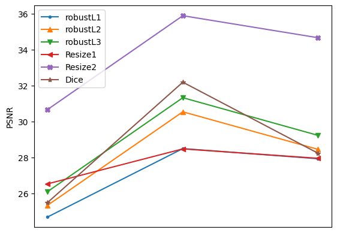
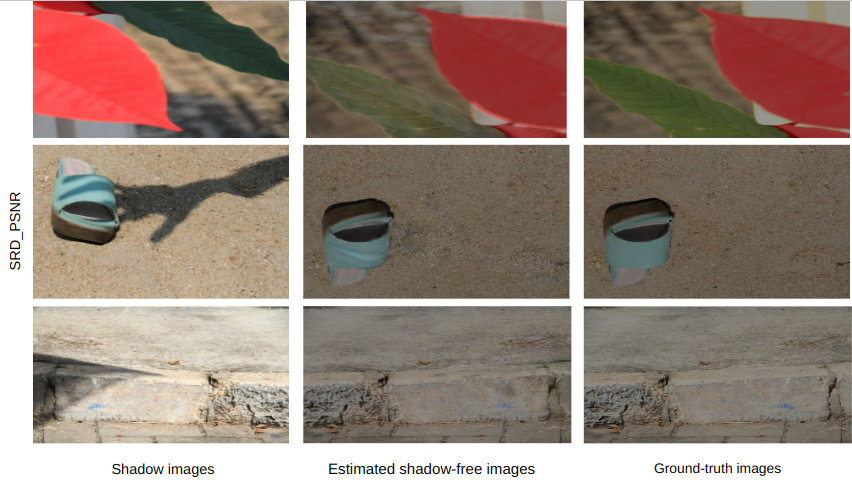

# Shadow Removal Using Deformable Convolution.

## Overview

This repository contains the implementation of a deep-learning model for shadow removal using Deformable Convolution. The model is implemented in PyTorch.

## Architecture
This is the Block Diagram of the Architecture used for Deshadowing

  

  
## Model (Model.py)

- **Encoder**: Downsamples the input image.
- **Deformable Residual Block**: Utilizes deformable convolution and residual connections for feature extraction.
- **Decoder**: Upsamples the features to reconstruct the shadow-free image.
- **Rnet**: Integrates the Encoder, Deformable Residual Block, and Decoder.
- **ShadowRemoval**: Combines the Rnet for shadow removal task.


## Data Loader (data_loader.py)

The `data_loader.py` file contains the implementation of a custom dataset class `ShadowDataset` and
utility functions for loading and preprocessing data for shadow removal tasks.

### ShadowDataset Class

The `ShadowDataset` class is a custom dataset class designed for loading shadow removal datasets.
It supports both training and validation sets and provides functionality for data augmentation and preprocessing.
Key functionalities include:

- **Initialization**: The class initializes with the root directory of the dataset and whether it's for training or validation.
- **Transformations**: The `transform` method applies resizing, random horizontal and vertical flipping, and
   random rotation by 180 degrees to input images, masks, and ground truth images.
- **Data Loading**: The class loads images, masks, and ground truth images from the specified directories using PIL (Python Imaging Library).
- **Tensor Conversion**: The class converts images, masks, and ground truth images into PyTorch tensors.


## Utilities (utils.py)

The `utils.py` file contains utility loss functions and metrics used. Below is an overview of the functionalities provided:

- **PSNR (Peak Signal-to-Noise Ratio)**: The `psnr_np` function calculates the PSNR between two images.

- **Dice Coefficient**: The `dice_coefficient` function computes the Dice coefficient, a similarity metric commonly used in segmentation tasks.

- **Robust Loss**: The `robustloss` class implements the Shadow Robust Loss, a loss function designed for contrastive learning.

- **SSIM (Structural Similarity Index)**: The `SSIM` class and associated functions provide the SSIM metric for evaluating image quality.

- **RMSE (Root Mean Square Error)**: The `get_rmse` function calculates the RMSE between two images.

- **Image Conversion Utilities**: Functions like `tensor2img` and `save_img` facilitate the conversion and saving of images.

- **Color Space Conversion**: Functions like `rgb2lab` and its associated helper functions convert images between different color spaces.


## Train and Test (Train_Test.py)

The `train_model` function is responsible for training the shadow removal model using the specified data loaders, loss functions, optimizer,
scheduler, and other parameters. It iterates over the specified number of epochs, performing both training and testing phases in each epoch.

### Functionality

- **Training Loop**: The function iterates over each epoch and performs training and validation phases.
   In the training phase,it sets the model to training mode (`model.train()`) and updates the model parameters based on computed gradients.
   In the Testing phase,it sets the model to evaluation mode (`model.eval()`) and evaluates the model's performance on the Testing dataset without updating parameters.

- **Loss Computation**: The function computes the loss for each batch using the specified loss functions (`criterion_l1` and `criterion_robustloss`)
    and aggregates the loss over all batches in an epoch.

- **Model Evaluation**: During Testing, the function computes evaluation metrics for complete images, non-shadow regions, and shadow regions.

- **Checkpoint Saving**: The function saves checkpoints of the model at regular intervals and saves the best model based on the validation metric.


## Main (main.py)

The `main.py` script serves as the entry point for training a shadow removal model for differen datasets.
It includes functionalities for configuring the training process, loading data, initializing the model, defining loss functions, 
setting up the optimizer, and training the model.

Modify the configuration parameters in the `main.py` script according to your requirements,
such as batch size, number of epochs, optimizer settings, learning rate scheduler etc.


## Experimental setup
- Framework: PyTorch
- GPU: NVIDIA GeForce RTX 4090 GPU
- Adam optimizer with initial learning rate 4 * 10<sup>-4</sup>
- CosineAnnealingLR scheduler with initial learning rate 1 * 10<sup>-5</sup>
- Data augmentation
  - Random horizontal and vertical flipping.
  - Random rotation by 180 degrees.
    
## Datasets
- [ISTD](https://drive.google.com/file/d/1I0qw-65KBA6np8vIZzO6oeiOvcDBttAY/view)
- [ISTD+](https://drive.google.com/file/d/1rsCSWrotVnKFUqu9A_Nw9Uf-bJq_ryOv/view)
- [SRD](https://drive.google.com/file/d/1W8vBRJYDG9imMgr9I2XaA13tlFIEHOjS/view)


## Usage
1. Clone the repository:
    ```bash
    https://github.com/saipraneeth314/Image-Deshadowing-Using-Deformable-Convolution.git
    ```
2. Install conda environment and dependencies:
    ```bash
    conda env create -f Torch.yml
    ```
3. Navigate to the repository directory:
    ```bash
    cd Image-Deshadowing-Using-Deformable-Convolution-main
    ```
4. Create foldes with names:
    ```bash
    generated_images
    checkpoints
    ```
5. To train and test the model on your dataset ,run Main.py and modify the path in the train.py:
    ```bash
    python Main.py
    ```
    
## Results
### SRD PSNR Graph


### SRD PSNR images

